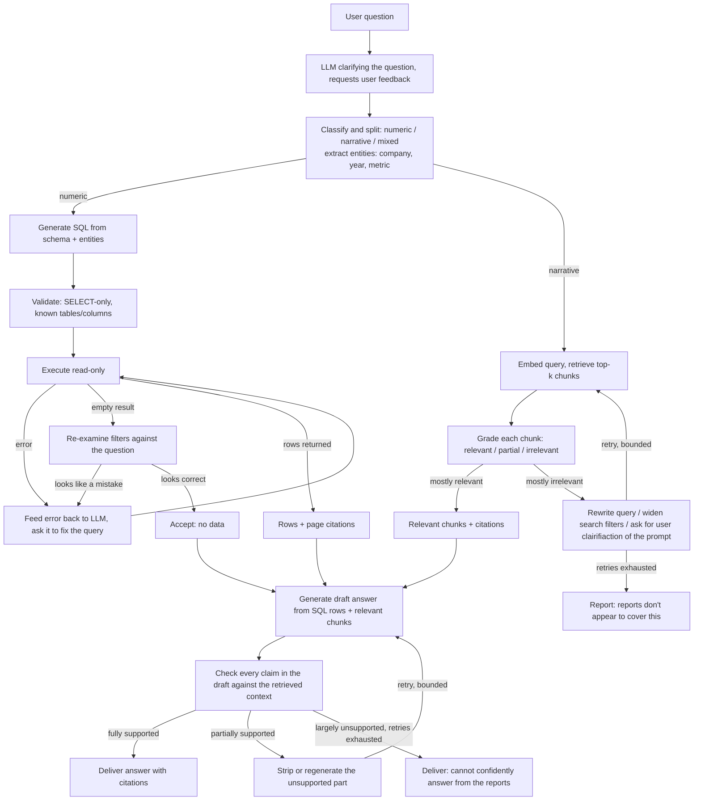

# Automated Financial Report Extraction & Local RAG System

*A step-by-step description of how the system goes from a list of companies to a working, self-correcting local question-answering system over their financial reports.*

---

## 0. Starting Point

The input is a seed table of companies:

```
companies(id, name, country, homepage_url, ajpes_id [nullable], sector)
```

Everything else — every report, every extracted number, every chunk in the vector index, every answer the system ever gives — is derived from this table plus what's found on the open web. The sections below trace the full path, in order, from that seed list to a verified answer to a user's question.

---

## Step 1 — From Homepage URL to Candidate Report PDFs

For each company in the seed list:

**1.1 Fall back to search only if 1.2–1.3 find nothing.** Some companies host reports on a third-party IR platform under a different domain, or use a site structure the heuristics above don't handle. A query like `"<company name>" annual report filetype:pdf` catches these without needing site-specific rules.

**1.2 Crawl candidate pages one level deeper.** Render each candidate with Playwright (scrolling to trigger lazy-loaded document lists, common on IR pages). Collect every link that either ends in `.pdf` or resolves to `content-type: application/pdf` via a HEAD request. Capture surrounding context too — the year and report type ("Annual Report 2023", "Q4 2023") are usually right next to the link in a table row, and this context feeds the classification step below.

**1.3 Deduplicate and classify.** Normalize all candidate URLs and remove duplicates. For each candidate `{url, anchor_text, surrounding_context, page_title}`, send a simple request to a small LLLM with a JSON schema:

```json
{"is_financial_report": bool, "report_type": "annual|quarterly|half_year|other",
 "fiscal_year": int|null, "confidence": 0.0-1.0}
```

Only candidates above a predefined confidence score move forward; low-confidence could go to a manual review queue instead of being ignored.

**Output of Step 1:** a list of `(company_id, pdf_url, report_type, fiscal_year, confidence)`

---

## Step 2 — From Candidate URL to Stored Raw PDF

**2.1 Download.** HTTP GET with retry/backoff and a realistic user-agent. Verify the response is actually a PDF by content-type.

**2.2 Hash and check for duplicates.** Compute a SHA-256 of the downloaded bytes. Check it against the `reports` table *before* doing anything else — if this exact file has already been processed, stop. This single check is what makes recurring (e.g. quarterly) re-crawls effective: only new documents go through the proccess.

**2.3 Store.** Save to `raw/{company_id}/{fiscal_year}/{report_type}_{hash8}.pdf`.

**2.4 Save metadata.** Insert a row into `reports(id, company_id, source_url, file_path, file_hash, fiscal_year, report_type, language, download_date, status='downloaded')` SQL database.

**Output of Step 2:** a raw PDF with a tracked, deduplicated metadata row.

---

## Step 3 — From PDF to Markdown
To be able to effectivly use the data in pdfs for RAG and easier (cheaper) processing PDFs need to be transforemed to a readable Markdown.

**3.1 Detect PDF type.** Extract text from the first 3 pages with PyMuPDF. If it comes back almost empty, the PDF is image-only. If the PDF is image only use Docling (3.2.), otherwise use the faster PyMuPdf.

**3.2 Convert.**
- *Digital-native PDFs:* run through **Docling**, which is layout-aware — it preserves tables as actual tables and keeps heading hierarchy. This matters directly: the balance sheet, income statement, and cash flow statement are all tables, and losing their structure here would make Step 4 much harder.
- *Scanned PDFs:* OCR via Tesseract, or a vision-capable LLM reading page images for cases with mixed-language, multi-column layouts that raw OCR handles poorly. --> very consuming should avoid

**3.3 Save the Markdown** next to the raw PDF (`processed/{company_id}/{fiscal_year}/{report_type}.md`). This file is now the single working representation used by *both* remaining branches of the pipeline — numeric extraction (Step 4) and narrative indexing (Step 5) — so this conversion only has to happen once per report.

**3.4 Locate the financial statements inside the Markdown.** Search headings for multilingual keyword pairs (*balance sheet / bilanca stanja*, *income statement / izkaz poslovnega izida*, *cash flow statement / izkaz denarnih tokov*). If a report's formatting is unusual enough that this misses, fall back to embedding each page/section and semantically searching for "balance sheet showing total assets and liabilities" — the embedding infrastructure needed for this is the same one built in Step 5, so this fallback costs nothing extra to add.

**Output of Step 3:** a Markdown file per report, with the financial-statement sections located and flagged.

---

## Step 4 — From Markdown to Structured SQL Rows
Some simple queries do not need a whole RAG and costly LLM queries, they can be done with data from SQL (using predefined SQL query statement, or providing the SQL schema to the LLM so it can write the SQL query).

**4.1 Structured extraction call.** For each located statement section, prompt an LLM for structured JSON output against a fixed, universal metric schema:

```
revenue, cogs, gross_profit, operating_income, ebitda, net_income,
total_assets, total_liabilities, total_equity,
cash_operating, cash_investing, cash_financing,
currency, period_start, period_end, page_reference
```

Nulls are allowed for anything the company doesn't report — the schema stays universal across markets precisely *because* it tolerates missing fields rather than assuming every company reports the same line items. Most reports show the current year next to the prior year for comparison — capture both, which doubles usable data per document at no extra crawl cost.

**4.2 Validate before trusting the numbers.** Do some generic checks, like `total_assets ≈ total_liabilities + total_equity` within rounding tolerance, and flag implausible relationships (e.g. net income far exceeding revenue). Anything that fails validation is marked `needs_review`, not ignored.

**4.3 Load.** Insert one row per `(report_id, metric_name, value, currency, period)` into an EAV-style `financials` table — this shape means adding a new metric later needs no schema migration, and naturally represents the fact that not every company reports every metric.

**4.4 Mark the report as `processed`.**

**Output of Step 4:** rows in `financials`, each traceable back to a specific report and page.

---

## Step 5 — From Markdown to Vector Index

**5.1 Chunk.** Split the Markdown — financials, management discussion, risk factors, outlook, auditor's notes — into ~500–800 token chunks, splitting on Markdown headers so a table is never cut mid-row.

**5.2 Tag.** Attach metadata to every chunk: `company_id, fiscal_year, report_type, section_heading, page_number, language`. This metadata is what lets retrieval later be filtered ("only chunks from this company's 2023 report") rather than searching the whole corpus blind.

**5.3 Embed.** Run chunks through a multilingual embedding model — this matters specifically because source documents are of different languages while questions are often asked in English.

**5.4 Store.** Vectors + metadata go into `pgvector`, in the same Postgres instance as the structured tables from Step 4 — one database to operate instead of two.

**Output of Step 5:** a searchable, metadata-filterable vector index covering every report's narrative content.

---

## Step 6 — Serving Questions: RAG with Corrective Loops

This is the stage where the system answers a user's question, and it's deliberately **not** a single retrieve-then-generate pass. Naive RAG has two well-known failure modes this design corrects for: (a) trusting a top-k similarity search even when the results are actually irrelevant, and (b) an LLM stating a number it "read" from a text chunk instead of a verified source. Both are addressed with explicit correction loops, each with a bounded number of retries so a hard question fails gracefully instead of looping forever.

It should be designed so that certain steps can be skipped depending on users preferences or resources limitations - if fast answers (less reliable) are needed the correction loops (6.1.1. and 6.3.2 and 6.5) can be skipped, if most reliable answeres are needed and resources are not a problem the amount of corrective loops and LLM checks, as well as core LLMs can be increased.



**6.1 Classify the question.** One LLM call determines whether the question is numeric ("what was X's 2023 revenue"), narrative ("what did management say about risk"), or mixed ("did revenue growth match what management said in the outlook") which is further split to the basic numeric and narrative questions, and extracts any explicit entities mentioned (company name, fiscal year, metric). This classification decides which path(s) below run.

**6.1.1 LLM to clariefy the question**
The question can be unlclear, too complex, provide too little context - we make a first LLM call to clarify the question and make it more readable for further steps (RAG), the LLM can suggest additional questions for user so that the question becomes clearer with the needed context.

**6.2 SQL path, with execution-feedback correction (numeric):**
1. Generate a SQL query from the question, the extracted entities, and the table schema.
2. Statically validate it (parse with `sqlglot`, reject anything that isn't a `SELECT`, confirm referenced tables/columns actually exist) — guardrail.
3. Execute in a read-only transaction.
4. **On an execution error** (unknown column, syntax mistake): feed the exact error message back to the LLM along with the original query and ask for a corrected version. Retry up to a fixed number of times.
5. **On an empty result set:** don't treat this as final by default — ask the LLM to re-examine whether a filter looks like a mistake (wrong fiscal year, a company-name mismatch against the `companies` table). If it identifies a likely fix, retry with corrected filters; if not, after a couple of attempts, accept "no data" as the honest answer.
6. **On success:** carry the result rows forward along with their `page_reference` values as citations.

**6.3 Vector path, with corrective retrieval (narrative):**
1. Embed the query (entity-annotated from Step 6.1) and retrieve the top-k chunks, filtered by any known company/year metadata.
2. **Grade each retrieved chunk** with a separate, lightweight LLM call: relevant / partially relevant / irrelevant to the actual question. This is the core "corrective" idea — a similarity-search hit is not assumed to be a useful answer just because it scored highly.
3. **If most chunks grade relevant:** proceed with that subset.
4. **If most grade irrelevant:** trigger a correction (6.1.1), tried in order: (a) rewrite the query — expand abbreviations, add likely Slovenian financial terminology if the source is in Slovenian, resolve vague references — and retry retrieval once; (b) widen the search — increase k, or drop an overly narrow metadata filter (e.g. a specific fiscal year) and let the model reason across a broader range. If both corrections are exhausted without success, the system reports honestly that the available reports don't appear to cover the question, rather than answering from irrelevant context.

**6.4 Generate the draft answer.** The local chat model receives the question, any SQL result rows with their citations, and the graded-relevant chunks with theirs, with an explicit instruction to state only what's supported by the provided context and to cite the source report/page for every claim.

**6.5 Verify groundedness before showing the answer.** A second LLM pass checks the draft against the retrieved context, claim by claim:
- **Fully supported** → passes through to the user as-is.
- **Partially supported** → the unsupported portion is stripped, or the model is asked to regenerate with an explicit instruction to remove or hedge that claim; or gives the user a clear warning on unconfirmed claims.
- **Largely unsupported**, even after one regeneration attempt → the system returns an honest "I don't have enough information in the reports to answer that confidently" instead of presenting an unverified claim as fact; the option to still the return the response to the user is there but the response must be marked as not verified!

**6.6 Deliver.** The final answer carries inline citations back to `(company, report_type, fiscal_year, page)`, so every number and claim can be checked against the original PDF.

**Why the retries are bounded, not unlimited:** each correction cycle costs another LLM call, and on the CPU-only local hardware this runs on, that's seconds to tens of seconds per call. An unbounded "keep trying until it works" loop could turn a single question into a multi-minute wait with no guarantee of success. Capping retries at 2–3 per path and having an explicit, honest failure state (rather than looping indefinitely or silently guessing) is both a hardware necessity and, independently, better behavior for a system answering financial questions.

---

## Step 7 — Worked Example, End to End

To make the above concrete, tracing one full pass through the system:

(pipeline - data preparation - done once)
1. **Seed list** contains all Slovenian and Croation publicly traded companies. A scheduled run reaches it.
2. **Step 1** finds its investor-relations page with a search `<comapny name> financial reports`, procedes with keyword scoring on the homepage (no search fallback needed), locates all pdfs, and the LLM classifier confirms `{is_financial_report: true, report_type: "annual", fiscal_year: 2024, confidence: 0.97}`.
3. **Step 2** downloads it; the hash doesn't match anything already in `reports`, so it proceeds; metadata is logged as `status='downloaded'`.
4. **Step 3** detects a digital-native PDF, converts it with Docling, and locates the balance sheet and income statement sections by their Slovenian headings.
5. **Step 4** extracts `revenue`, `net_income`, `total_assets`, etc. for both 2024 and the 2023 comparative column, validates that assets equal liabilities plus equity, and loads 20-odd rows into `financials`.
6. **Step 5** chunks and embeds the whole pdf, etc. the outlook and risk-factor sections, tagged with this company's ID and fiscal year 2024.

(final RAG - the app)
1. A user later asks: *"Did the company's net income growth in 2024 match what management said was driving performance?"*
2. **Step 1** the prompt goes to the lightweight LLM to suggest clarifications (which company?), user provides the context and this step is repeated untill the LLM grades the prompt as clear.
3. **Step 2** classifies this as **mixed**, splitting the question in 2; extracting `company = <this company>`, `fiscal_year = 2024`, `metric = net_income`.
4. **Step 3** generates and runs SQL comparing 2024 and 2023 `net_income` for this company — succeeds on the first attempt, returns both figures with page citations.
5. **Step 4** retrieves chunks from the 2024 outlook section; grading confirms most are relevant on the first pass, so no correction is needed here.
6. **Step 5** drafts an answer combining the net-income comparison with the narrative drivers mentioned in the outlook.
7. **Step 6** checks the draft: the income figures are grounded in the SQL rows, and the narrative claims are grounded in the retrieved chunks — verification passes without needing a regeneration.
8. **Step 7** delivers the answer with citations to both the specific financial-statement page and the outlook section page.

---

## Hardware Context Behind These Design Choices

- **A two-tier local model strategy:** a smaller model (e.g. Qwen2.5 7B, ~4.5GB at Q4 quantization) handles interactive Steps 6.1–6.6, while a larger model (e.g. Qwen2.5 14B, ~8–9GB) is used for the less time-sensitive batch extraction in Step 4, run overnight. Ollama loads/unloads these automatically so they never need to coexist in memory.
- **Sequential, not parallel, pipeline stages:** the crawler (Step 1, a memory-hungry headless browser) is never run at the same time as a loaded LLM, to stay within the 16GB budget.
- **Bounded correction loops** in Step 6 are as much a hardware necessity (each retry is an LLM call at single-digit tokens/second) as a correctness feature.

---

## Tech Stack Summary

| Step | Tool |
|---|---|
| 1. Discovery | Playwright, multilingual keyword scoring, search-engine fallback, `browser-use` (last-resort agentic tier) |
| 2. Storage | SHA-256 hashing, PostgreSQL metadata table |
| 3. PDF → Markdown | Docling, Tesseract/vision-LLM OCR fallback |
| 4. Extraction → SQL | Local LLM (JSON-schema output), PostgreSQL (EAV `financials` table) |
| 5. Embedding | Multilingual embedding model (e.g. EmbeddingGemma), pgvector |
| 6. RAG serving | Text-to-SQL with `sqlglot` validation, vector retrieval with relevance grading, groundedness verification, Ollama-served local chat model |
| Orchestration | Prefect (scheduled, idempotent runs) |
